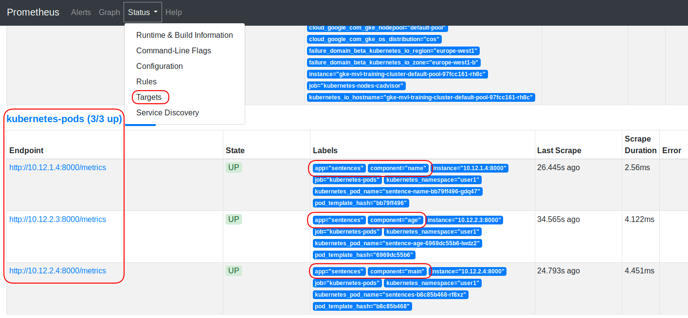
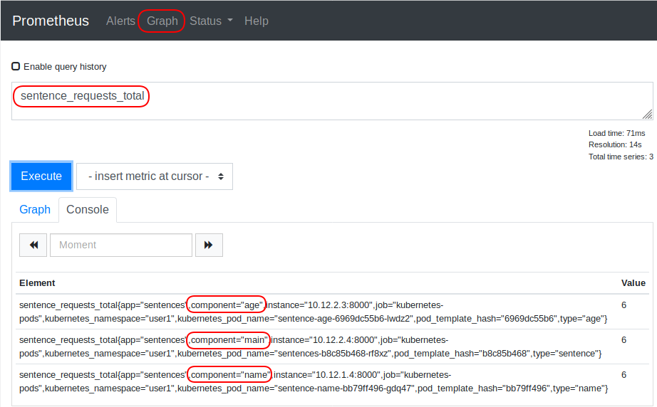
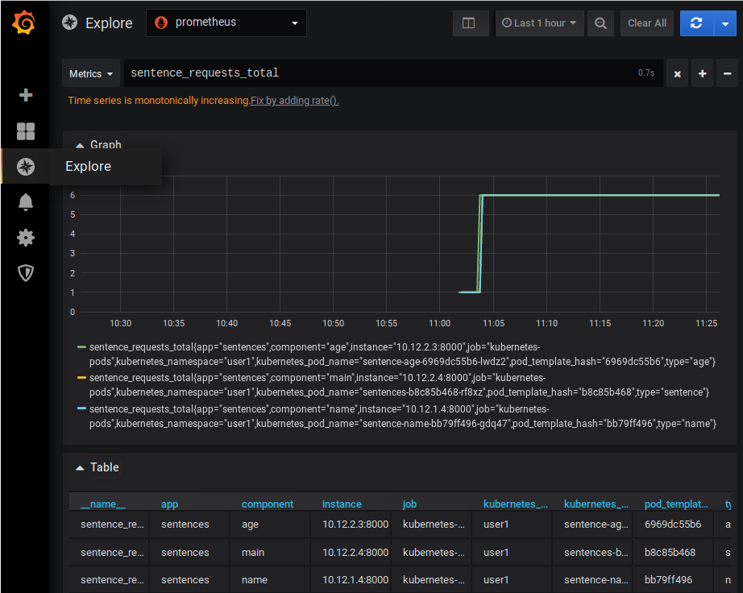

# Introducing Prometheus and Grafana

This exercise will demonstrate deploying the Prometheus and Grafana applications using Helm.

... TODO

## Deploying Prometheus and Grafana

First we will install Prometheus and Grafana using Helm. We will install them
from the `stable` repository. To see available repositories use:

First add a repository to your Helm installation:

```shell
$ helm3 repo add stable https://kubernetes-charts.storage.googleapis.com/
```

Next, you can inspect your Helm repositories with `helm repo list`:

```shell
$ helm repo list
stable  https://kubernetes-charts.storage.googleapis.com
```

To look for available Helm chart you can use the `helm search` feature, e.g.:

```shell
$ helm2 search prometheus
$ helm3 search repo prometheus
stable/prometheus                       9.2.0           2.13.1          Prometheus is a monitoring system and time seri...
```

This show that Prometheus chart version 9.2.0 is available and that the version
of the Prometheus application in that chart is 2.13.1.  You most likely will see
newer versions when trying this out...

To install Prometheus and Grafana with settings suitable for the following
exercises use the following commands:

```shell
helm3 install prometheus stable/prometheus --version 9.2.0 -f resources/values-prometheus.yaml
helm3 install grafana stable/grafana --version 4.0.1 -f resources/values-grafana.yaml
```

> This exercise assume a Kubernetes cluster with metrics support. Most managed
> Kubernetes solutions will have support for metrics. On self-deployed clusters
> one might need to deploy the metrics-server application:
>
> ```shell
> $ helm3 install metrics-server stable/metrics-server --version 2.8.8 --set args[0]="--kubelet-insecure-tls"
> ```

After running these command you can inspect the installed Helm-based
applications with `helm ls`:

```shell
$ helm ls
grafana         user1           1               2019-11-04 09:23:52.163779429 +0000 UTC deployed        grafana-4.0.1
prometheus      user1           1               2019-11-04 08:49:53.769610017 +0000 UTC deployed        prometheus-9.2.0
```

Also, inspect the PODs that these applications are based upon:

```shell
$ kubectl get pods
grafana-5c7b9b967f-pnkd2             2/2     Running   0          71s
prometheus-server-868b8cdb59-d7gpq   2/2     Running   0          48s
```

Note that Grafana is deployed **without TLS** and as such this is not a
deployment that is suitable for production use.

Grafana is exposed with a Kubernetes service of type `LoadBalancer`. Use the
following commands to get the external IP address/port and the Grafana `admin`
user password:

```shell
$ kubectl get -o jsonpath="{.spec.ports[0].nodePort}" services grafana
$ kubectl get nodes -o wide
$ kubectl get secret grafana -o jsonpath="{.data.admin-password}" | base64 --decode ; echo
```

## Deploying the Application

The sentences application can be deployed with the following command. If you
created a Helm chart for the application in a previous exercise feel free to use
that chart for deploying the sentences application.

```shell
$ kubectl apply -f sentences-app/deploy/kubernetes/
```

After this, we should have 5 PODs running (Prometheus, Grafana and three PODs for the sentences application).

## Debugging Metrics

In the following we will look into:

- How to manually query metrics exported from an application prepared for Prometheus
- How Prometheus maintains status for each auto-discovered scrape-targets (like our application PODs)
- How we can query and display metrics with Prometheus, i.e. without Grafana

Going through these steps will not only give good insight into the metrics
framework but also show the primary techniques necessary when application
metrics fail to be available in Grafana.

### Debugging Metrics From PODs

First, lets manually query the metrics from our sentences application. Remember
that each microservice exports a metric called `sentence_requests_total` which
is a counter that increments for each request the microservices processes.

The sentences application exports metrics on port 8000. Any port can be used,
and we will later see how Prometheus figures out which port to scrape for
metrics.

To help us manually query metrics, we create a Kubernetes service that use port
8000 of one of the deployments in our sentences application. The following
example use the main `sentences` deployment:

```shell
$ kubectl expose deploy sentences --name sentences-metrics --port 8000 --target-port 8000 --type NodePort
```

This service use a NodePort, hence to query the metrics API we can look up the
port and query if with curl. First, llook up a node IP address and the specific node
port using `kubectl`:

```shell
$ kubectl get nodes -o wide
$ kubectl get -o jsonpath="{.spec.ports[0].nodePort}" services sentences-metrics
```

Second, query the metrics API of the sentences deployment:

```shell
$ curl -s <NODE-IP>:<PORT>/metrics | egrep '^sentence'
```

We use `egrep` here to filter out the primary information, and we will see the following output:

```
sentence_requests_total{type="sentence"} 6.0
```

This show that we have a metric with name `sentence_requests_total` with a label
`type` that have the value `sentence`. The other microservices `age` and `name`
use values `age` and `name` respectively for the `type` label. Metrics can have
many labels and with these we can separate metrics into different dimensions,
e.g. microservice type, versions etc. The metric name `sentence_request_total`
can be considered the *what* and the labels define the *who*.

Our `curl` operation showed that the metrics API on the sentences application
works as expected.  If this had not worked, we should debug the microservice
itself.

### Debugging Prometheus Metrics Scraping

Next, we look into Prometheus. The Prometheus GUI is exposed using a
NodePort-type service. Look up the node port as above and open the GUI in a web
browser.

```shell
$ kubectl get -o jsonpath="{.spec.ports[0].nodePort}" services prometheus-server
```

When you have the Prometheus GUI op, select the `Status` menu item and then the
`Targets` option as shown below.

This shows the list of targets that Prometheus has identified through the
Kubernetes API. We see that three POD target show up with the labels matching
the three microservices of the sentences application. If our list of scrape
targets do not match our expectation we should verify that 1) Our Kubernetes
resources are correctly annotated to tell Prometheus to scrape then and that the
port and path is correct and 2) that Prometheus is deployed with proper
Kubernetes authorization to auto-discover scrape targets through the Kubernetes
API.



Next, select the `Graph` menu item and type in `sentence_requests_total` in the
query box as shown below. This will show the number of requests handled by each
of the microservices in the sentences application.  The fact that we see metrics
here verifies that the metrics of the sentences application is available from
Prometheus.



## Explore Metrics in Grafana

The GUI Prometheus is mostly used for low-level debugging and metrics are
typically visualized with Grafana since Grafana provides many more options for
building dashboards.

When logged-in to Grafana go to the *camera shutter* option in the left-side,
which is the metrics *explore* feature. This feature provide access to a simple
metrics query option, which often is used instead of directly accessing
Prometheus when we are beyond basic debugging of the metrics feature.

In the query box type the metrics name `sentence_requests_total` as shown below:



This shows that Grafana can access metrics from Prometheus.

## Deploying a Dashboard

Dashboards can be created manually but often an existing dashboard should be
used.  Grafana supports dynamically loading of dashboards through Kubernetes
ConfigMaps. If we have an existing dashboard in JSON format, we can simply
create a ConfigMap containing the JSON file and annotate the ConfigMap to let
Grafana know it should use the content as a dashboard.

To install a dashboard for the sentences application create and annotate a
ConfigMap as follows:

```shell
$ kubectl create configmap dashboard --from-file sentences-app/dashboard.json
$ kubectl label configmap dashboard grafana_dashboard='1'
```

After this you will be able to use the dashboard in Grafana. To generate some
load on the sentences application, use the following command and watch the
effect in the dashboard:


```shell
$ kubectl apply -f resources/load-generator.yaml
```


# Cleanup

Delete the applications and additional services with the following commands:

```shell
$ kubectl delete -f sentences-app/deploy/kubernetes/
$ helm3 delete grafana
$ helm3 delete prometheus
$ kubectl delete configmap dashboard
$ kubectl delete svc sentences-metrics
$ kubectl delete -f resources/load-generator.yaml
```
