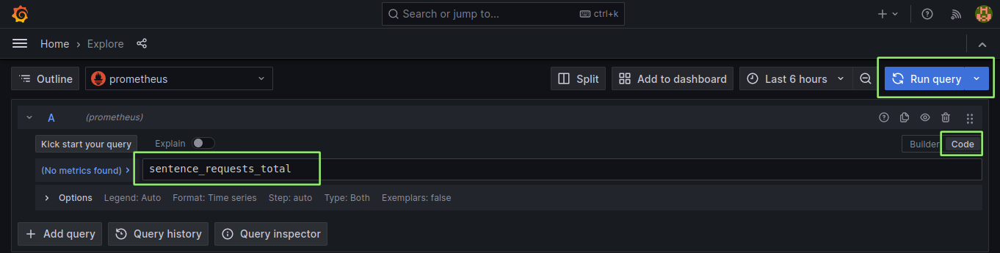

# Introducing Prometheus and Grafana

This exercise will demonstrate deploying the Prometheus and Grafana applications
using Helm. We will also deploy the sentences application and inspect how
metrics are propagated from the application through Prometheus and displayed in
Grafana.

## Deploying Prometheus and Grafana

First we will install Prometheus and Grafana using Helm. We will install them
from their community repositories. To see available repositories use:

First add repositories to your Helm installation:

```shell
$ helm repo add prometheus-community https://prometheus-community.github.io/helm-charts
$ helm repo add grafana https://grafana.github.io/helm-charts
```

Next, you can inspect your Helm repositories with `helm repo list`:

```shell
$ helm repo list
NAME                    URL
prometheus-community    https://prometheus-community.github.io/helm-charts
grafana                 https://grafana.github.io/helm-charts
```

To look for available Helm chart you can use the `helm search` feature, e.g.:

```shell
$ helm search repo prometheus
NAME                                                    CHART VERSION   APP VERSION     DESCRIPTION
prometheus-community/prometheus                         13.0.1          2.22.1          Prometheus is a monitoring system...
```

This show that Prometheus chart version 13.0.1 is available and that the version
of the Prometheus application in that chart is 2.22.1.  You most likely will see
newer versions when trying this out...

To install Prometheus and Grafana with settings suitable for the following
exercises use the following commands:

```shell
$ helm install prometheus prometheus-community/prometheus --version 13.0.1 -f resources/values-prometheus.yaml
$ helm install grafana grafana/grafana --version 6.1.16 -f resources/values-grafana.yaml
```

> This exercise assume a Kubernetes cluster with metrics support. Most managed
> Kubernetes solutions will have support for metrics. On self-deployed clusters
> one might need to deploy the metrics-server application:
>
> ```shell
> $ helm install metrics-server stable/metrics-server --version 2.8.8 --set args[0]="--kubelet-insecure-tls"
> ```

After running these command you can inspect the installed Helm-based
applications with `helm ls`:

```shell
$ helm ls
NAME            NAMESPACE       REVISION        UPDATED                                 STATUS          CHART                   APP VERSION
grafana         user1           1               2020-12-22 07:35:22.209543882 +0000 UTC deployed        grafana-6.1.16          7.3.5
prometheus      user1           1               2020-12-22 07:35:11.826098609 +0000 UTC deployed        prometheus-13.0.1       2.22.1
```

Also, inspect the PODs that these applications are based upon:

```shell
$ kubectl get pods
grafana-5c7b9b967f-pnkd2             2/2     Running   0          71s
prometheus-server-868b8cdb59-d7gpq   2/2     Running   0          48s
```

Note that Grafana is deployed **without TLS** and as such this is not a
deployment that is suitable for production use.

Grafana is exposed with a Kubernetes service of type `NodePort`. Use the
following commands to get the external IP address/port and the Grafana `admin`
user password:

```shell
$ kubectl get -o jsonpath="{.spec.ports[0].nodePort}" services grafana
$ kubectl get nodes -o wide
$ kubectl get secret grafana -o jsonpath="{.data.admin-password}" | base64 --decode ; echo
```

## Deploying the Application

The sentences application can be deployed with the following command.

```shell
$ kubectl apply -f sentences-app/deploy/kubernetes/
```

After this, we should have 5 PODs running (Prometheus, Grafana and three PODs
for the sentences application).  To verify that the application is running, look
up the main service and node-port and fetch a result with curl as we did in the
[hello-sentences-app](hello-sentences-app.md) exercise.

## Debugging Metrics

In the following we will look into:

- How to manually query metrics exported from an application prepared for Prometheus
- How Prometheus maintains status for each auto-discovered scrape-targets (like our application PODs)
- How we can query and display metrics with Prometheus, i.e. without Grafana

Going through these steps will not only give good insight into the metrics
framework but also show the primary techniques necessary when application
metrics fail to be available in Grafana.

### Debugging Metrics From PODs

First, lets manually query the metrics from our sentences application. Remember
that each microservice exports a metric called `sentence_requests_total` which
is a counter that increments for each request the microservices processes.

The sentences application exports metrics on port 8080 and path
'/metrics'. Prometheus can be configured to fetch metrics from any port and
path, and we will later see how Prometheus figures out which port to scrape for
metrics.

Query metrics API of the sentences deployment similarly to how you fetched
sentences. The difference is that we add the '/metrics' path to the query:

```shell
$ curl -s <NODE-IP>:<PORT>/metrics | egrep '^sentence'
```

We use `egrep` here to filter out the essential information, and we will see the
following output:

```
sentence_requests_total{type="sentence"} 6
```

> If you get no results here, it could be because the sentences application has
> recently been deployed and metrics with a value of zero are not exported,
> i.e. until you fetch a sentence for the first time, the curl above will return
> nothing. Try fetching a sentence as shown in prior exercises and fetch metrics
> again.

Try fetching more sentences and metrics to see the `sentence_requests_total`
metric increment.

This show that we have a metric with name `sentence_requests_total` with a label
`type` that have the value `sentence`. The other microservices `age` and `name`
use values `age` and `name` respectively for the `type` label. Metrics can have
many labels and with these we can separate metrics into different dimensions,
e.g. microservice type, versions etc. The metric name `sentence_request_total`
can be considered the *what* and the labels define the *who*.

Our `curl` operation showed that the metrics API on the sentences application
works as expected.  If this had not worked, we should debug the microservice
itself.

### Debugging Prometheus Metrics Scraping

Next, we look into Prometheus. The Prometheus GUI is exposed using a
NodePort-type service. Look up the node port as we did above with Grafana and
open the GUI in a web browser:

```shell
$ kubectl get -o jsonpath="{.spec.ports[0].nodePort}" services prometheus-server
```

When you have the Prometheus GUI op, select the `Status` menu item and then the
`Targets` option as shown below. Scroll down to the section with the heading `kubernetes-pods (3/3 up)`

This shows the list of targets that Prometheus has identified through the
Kubernetes API. We see that three POD target show up with the labels matching
the three microservices of the sentences application (if you are running the
exercises on a shared cluster you may see other users applications as well). If
our list of scrape targets do not match our expectation we should verify that 1)
Our Kubernetes resources are correctly annotated to tell Prometheus to scrape
then and that the port and path is correct and 2) that Prometheus is deployed
with proper Kubernetes authorization to auto-discover scrape targets through the
Kubernetes API.


Next, select the `Graph` menu item and type in `sentence_requests_total` in the
query box as shown below and press return. This will show the number of requests
handled by each of the microservices in the sentences application.  The fact
that we see metrics here verifies that the metrics of the sentences application
are available from Prometheus.


## Explore Metrics in Grafana

The GUI Prometheus is mostly used for low-level debugging and metrics are
typically visualized with Grafana since Grafana provides many more options for
building dashboards.

When logged-in to Grafana go to the *Explore* option in the left-side (see
picture below). This feature provide access to a simple metrics query option,
which often is used instead of directly accessing Prometheus when we are beyond
basic debugging of the metrics feature.

In the query box type the metrics name `sentence_requests_total` and press the
*Run Query* button in the top-right corner as shown below:



This shows that Grafana can access metrics from Prometheus.

## Deploying a Dashboard

Dashboards can be created manually but often an existing dashboard should be
used.  Grafana supports dynamically loading of dashboards through Kubernetes
ConfigMaps. If we have an existing dashboard in JSON format, we can simply
create a ConfigMap containing the JSON file and annotate the ConfigMap to let
Grafana know it should use the content as a dashboard.

To install a dashboard for the sentences application create and annotate a
ConfigMap as follows:

```shell
$ kubectl create configmap dashboard --from-file sentences-app/dashboard-w-ns-selector.json
$ kubectl label configmap dashboard grafana_dashboard='1'
```

After this you will be able to use the dashboard in Grafana.  Go to the
*Dashboards* option above the *Explore* option and select `Home` and/or `Manage`
to see newly loaded dashboards. Note that the dashboard have a namespace
selector in the top and you will need to select your own namespace to monitor
your sentences application.

To generate some load on the sentences application, use the following command
and watch the effect in the dashboard:


```shell
$ kubectl apply -f resources/load-generator.yaml
```

After a short while, you should see the effect of the generated load in the
dashboards with *requests/s* and also the *POD cpu usage*.

> The time it takes for the data to arrive in Grafana, is dependent on the
> `scrape_interval` configured for Prometheus. This can be located in the 
> Prometheus UI under `Status -> Configuration`.

## Autoscaling

if you are doing this exercise after having done the auto-scaling section, you
could deploy the HorisontalPODAutoscaler resource to see auto-scaling and the
dashboard with POD counts for the individial microservices to change.

```shell
$ kubectl apply -f sentences-app/deploy/hpa.yaml
```

## Cleanup

Delete the applications and additional services with the following commands.

*NB: If you are going to proceed to the next Prometheus/Grafana exercise, you will
want to leave everything running for now.*

```shell
$ kubectl delete -f sentences-app/deploy/kubernetes/
$ helm delete grafana
$ helm delete prometheus
$ kubectl delete configmap dashboard
$ kubectl delete -f resources/load-generator.yaml
$ kubectl delete -f sentences-app/deploy/hpa.yaml
```
