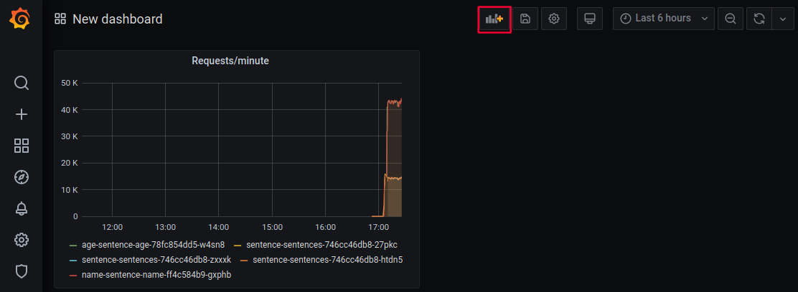

# Prometheus Metrics and Grafana Dashboards

## Learning goals

- Learn how to query Prometheus metrics
- Learn how to create Grafana dashboards
- (optional) Learn how to use Grafana variables


## Introduction

> :bulb: This exercise assumes you have Prometheus, Grafana and the sentences application
> and load generator running. If not, see the [Introducing Prometheus and
> Grafana](introducing-prometheus-and-grafana.md) exercise.

In this exercise we will create a Grafana dashboard that shows the number of requests per minute for each microservice type.

The promQL language used to query Prometheus metrics is very powerful and can be used to create very complex queries.  In this exercise we will only use a few examples.

There are many [Prometheus
functions](https://prometheus.io/docs/prometheus/latest/querying/functions/) and
[Prometheus
operators](https://prometheus.io/docs/prometheus/latest/querying/operators/)
that provide many options for querying metrics.

We will both look at aggregated metrics like the number of requests a particular pod have recieved overall.

We will also use the time series nature of Prometheus to look at the number of requests per minute for each microservice type.

At the end of the exercise you will have a dashboard that displays two graphs:

- Number of requests per minute for each microservice type
- Number of requests per minute for each microservice POD
## Exercise

The exercise is divided into the following steps:

- [Scale the Front-end](#scale-the-front-end)
- [Choose Metric Queries](#choose-metric-queries)
- [Metric Labels](#metric-labels)

## Scale the Front-end

front-end sentences microservice is scaled to three replicas:

```shell
$ kubectl scale --replicas 3 deployment sentences
```

## Choose Metric Queries

The first thing to do before creating a dashboard is to chose a query that
return a metric we want to display in a dashboard. 

- Go to the Grafana *explore* feature 
- in the query box type the metrics name `sentence_requests_total`.

> :bulb: This query might show metrics from users in other namespaces and to limit results to your own namespace add a filter on the namespace label by using the following query where you replace `studentXX` with the name of your own namespace (make this replacement in all the following examples).

- change the metric to `sentence_requests_total{kubernetes_namespace="studentXX"}` and observe the results.

Number of requests are typically easier to understand when given over time.
We can change the query which Grafana sends to Prometheus to include a time range in the following way:

- Change the metric to `rate(sentence_requests_total{kubernetes_namespace="studentXX"}[2m])*60` and observe the results.

With this query, Prometheus will return metrics with a per-minute average
measured over the last 2 minutes. 
We convert the metric into a requests/minute metric (the `rate` function return per-second changes which we multiply by 60).

The data returned with the above query results in five different sets of data and the table also show five results. 

The five results in their labels. 

An example of that is the value of the `type` label.

- Identify `sentence`, `age` and `name` as the three different values of the `type` label.

- Observe that the `kubernetes_pod_name` label have different values matching the actual POD names of our Kubernetes PODs. 

- Compare the `kubernetes_pod_name` label values with `kubectl get pods` to verify this

```shell
kubectl get pods
NAME                                 READY   STATUS    RESTARTS   AGE
grafana-6859599fc4-frlw4             2/2     Running   0          3h26m
loadgen-69fb994f88-8gg4s             1/1     Running   0          127m
prometheus-server-75667d4974-rc9jp   2/2     Running   0          3h27m
sentence-age-58cb74bdd-9v468         1/1     Running   0          3h23m
sentence-name-f9b7684b4-x297j        1/1     Running   0          3h23m
sentences-5b8cb547b9-2vppc           1/1     Running   0          3h23m
sentences-5b8cb547b9-5dt4c           1/1     Running   0          114m
sentences-5b8cb547b9-cml4p           1/1     Running   0          114m
```

Congrats, this is the first metric query for our dashboard.

## Metric Labels

For our second metric query in our dashboard we want request/minute for each microservice type `sentence`, `age` and `name`.

This can be done by using the Prometheus `sum()` aggregation operator. 

- Enter the following query into Grafana: `sum(rate(sentence_requests_total{kubernetes_namespace="studentXX"}[2m]))`

This results in a single curve, hence all the `sentence_requests_total` metrics
from all microservices have been aggregated into a single metric.
It is not quite what we wanted.

We need to specify to the `sum()` operator across which labels we want
aggregation. 

- Append `by (type)` at the end of the query to group the metrics by the `type` label.

<details>
<summary>:bulb: full query</summary>

`sum(rate(sentence_requests_total{kubernetes_namespace="studentXX"}[2m])) by (type)`

</details>

This will result in a set of data for each of our microservice types and this
will be our second metric query for our dashboard.

## Create a Dashboard

- Go back to the main page of Grafana by selecting the *Dashboards* (four squares)
button above the *explore* button and select the *Create your first dashboard*
button in the right of the window as shown below:


- Click the blue *Add new panel* button.

We will use the default visualization which is *Graph*.

:bulb: You can change the visualization type by selecting *Visualization* in the right-hand size (see
below).

Queries are entered in the field starting with `Metrics` as shown below:


- Enter our first Prometheus metric query (replace `studentXX` with your user namespace):

```
rate(sentence_requests_total{kubernetes_namespace="studentXX"}[2m])*60
```

You should see the metric as a graph and very long legend names below the graph.

- Below the `Metrics` field in the `Legend` box enter the following to
allow Grafana to generate legends using the values of the `type` and
`kubernetes_pod_name` labels.

```
{{type}}-{{kubernetes_pod_name}}
```

The graph title currently says "Panel Title". 

- Go to the panel in the right-hand side and change the *Panel title* to `Requests/minute`.

- Select the *back arrow* in the top-left corner to exit this graph. 
- Select the *Add panel* button as shown below:



- Repeat the process for adding a panel with our second metric, which was:

```
sum(rate(sentence_requests_total{kubernetes_namespace="studentXX"}[2m])) by (type)
```

- Using the following legend:

```
{{type}}
```

- Use the *back arrow* to go back to the main dashboard page

You have now gotten two graphs in your dashboard :tada:

## Re-arranging Visualizations and Saving Dashboards

In the main dashboard page, you can re-arrange and re-size the panels using the
mouse.

- Save the dashboard by using the *Save dashboard* button in the top-right corner next to the *Add panel* button. 

After the dashboard has been saved, a *Share dashboard* button will show up in the top-left corner after the dashboard
title, like below:


- Press the *Share dashboard* button, select the *Export* tab and *Save to file*.

This will start a download of the dashboard in JSON format.

## Importing the Saved Dashboard

In the [Introducing Prometheus and
Grafana](introducing-prometheus-and-grafana.md) exercise we loaded an existing
dashboard from a JSON file. 
Now that we have created our own dashboard we can load it into Grafana.  

- First delete the current dashboard by selecting the *Dashboard settings* button to the right of the *Save dashboard* button in the top-right corner.

- Copy the dashboard from where you downloaded it, onto the VM instance where you are running kubectl commands. The filename should be `my-dashboard.json`.

With the file (named `my-dashboard.json`) on your instance, you can now run:

- Transform it into a configmap `kubectl create configmap my-dashboard --from-file my-dashboard.json`
- Label it so Grafana picks it up `kubectl label configmap my-dashboard grafana_dashboard='1'`


Grafana should now automatically load the dashboard and you can select it by
using the *Dashboards* button in the left-side of the window 
(possibly select the *Home* and *Manage* sub-options a few times 
since it might take some seconds before Grafana loads the dashboard)

You have now created your first Grafana dashboard _as code_ :tada:
## Extra: Add a Drop-down Selector for Namespace

<details>
<summary> Steps if you have time</summary>

Instead of hard-coding the namespace in the Prometheus queries, we can add a
drop-down selector as shown in the example dashboard in the
[introducing-prometheus-and-grafana](introducing-prometheus-and-grafana.md)
exercise.

Such a drop-down introduce a variable that we can use in your Prometheus queries
instead of hard-coded names. To add a variable to a dashboard, select the
`Dashboard Settings` gear icon in the top-right corner of the dashboard.  In the
menu that shows up, select `Variables` and select `Add variable`.

Enter `namespace` in the 'Name' input field, select `prometheus` in the `Data
source` field and enter `label_values(kubernetes_namespace)` in the query input
field. To filter out unnecessary choices, enter `student.*` in the `Regex` field.
Through this we create a variable that dynamically updates and get the possible
choices of the namespace variable from the values of the `kubernetes_namespace`
label, however, only the values that match the regular expression we
defined. See the `Refresh` setting for when the choices of the variable is
refreshed.

Select `Add` to save the variable to your dashboard.

Press the `Back arrow` in the top-left corner to go back to the dashboard.

Click the panel title of one of the dashboard panels and select `Edit`. In the
metrics query field replace the hard-coded `studentXX` by `$namespace` and press the
`Back arrow` in the top-left corner. Do this for all panels.

Notice that when you try to save it, Grafana will tell you that 
it can't save a provisioned dashboard, but let you export the dashboard as JSON.

Update `my-dashboard.json` on your instance, delete the `configmap` you created before,
recreate it with the updated JSON file, and label it so Grafana picks it up.

After a short while your dashboard should show up again, using the `$namespace`-variable
on the graphs.

</details>

## Cleanup

*NB: If you are in a instructor led course, do not clean anything.*

<details>
<summary>:bulb: Cleanup for stand-alone use of the exercise</summary>

Delete the applications and additional services with the following commands.

```shell
kubectl delete -f sentences-app/deploy/kubernetes/
helm delete grafana
helm delete prometheus
kubectl delete configmap dashboard
kubectl delete -f resources/load-generator.yaml
```
</details>